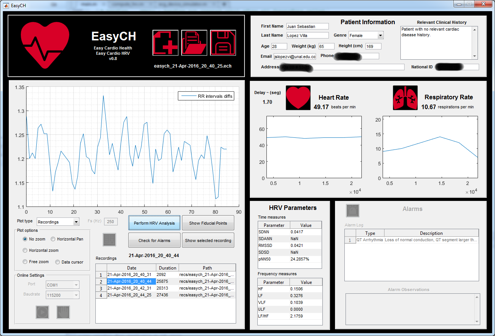

# easych
Easy Cardio Health and Cardio HRV (Heart Rate Variability) analysis tool implemented in MATLAB.

Main Features:
<ol>
<li>HRV Records: Can visualize RR interval diff (IBI) records.</li>
<li>Online:. Can visualize and record ECG signal acquired from serial port. Multiple records can be saved in a EasyCH project file (.ech).</li>
<li>Recordings: Can visualized saved recordings from Online monitoring. Also can process them finding fiducial points and performing HRV analysis and plotting of RR interval diffs.</li>
<li>ECG Records: Can visualize ECG recordings.</li>
</ol>

Among other features, are:
<ul>
<li>All the plots, except for online monitoring plot, can be zoomed, panned and browsed with a data cursor.</li>
<li>EasyCH can save recordings information as projects with extension .ech. EasyCH projects can be further opened by a physician for revision.</li>
<li>Alarm checking and generation. For ECG recordings saved, EasyCH can check for alarms and generate a list of found alarms. Observations to alarms can be made describing the situation of recordings to easy the job of physicians.</li>
<li>Patient clinical history. Personal information of patient can be associated to the project, like first and last names, age, weight, height, genre, and relevant clinical history data such as previous or current cardiovascular diseases. All this information is necessary for physicians to have a knowledge of patient for further diagnostics.</li>
<li>ECG delineation and fiducial points. Each signal of lenght larger than minimum time window (4 seconds), can be processed for delineation, it means, fiducial points finding. Fiducial points are P wave start (Pon), P wave end (Poff), Q wave start (Qon), R peak (Rpeak), S wave end (Soff), T wave start (Ton) and T wave end (Toff).</li>
</ul>

Screenshots:

<b>Main GUI:</b>
  
<b>ECG recording plots:</b>
  
  
<b>ECG delineation and fiducial points:</b>
  
  
<b>Heart Rate Variability analysis:</b>
   
   

